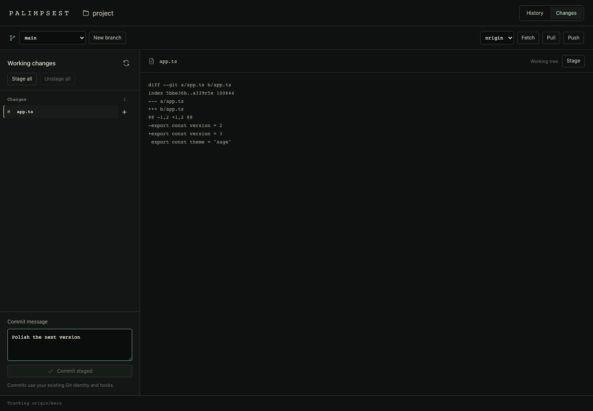
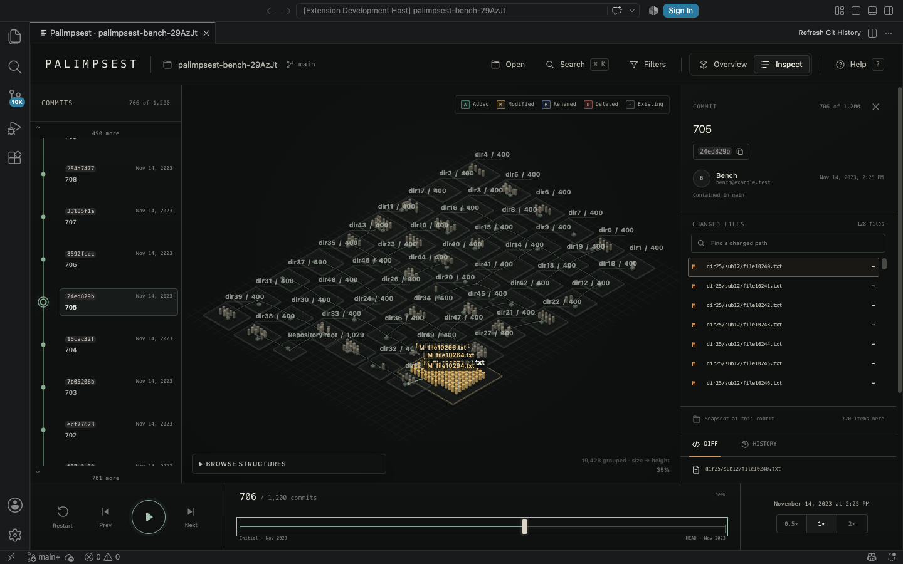

# Palimpsest — Git Workbench

Explore your history and manage your next commit in one Git workbench. Palimpsest combines an interactive repository landscape with working changes, staging, commits, branches, and remote operations. Open it from its own Activity Bar entry, beside your code, or in a separate VS Code window.



*A temporary example repository used to verify the complete Git workflow.*

## Make your next commit

- Review staged, modified, untracked, and conflicted files, with on-demand diffs.
- Stage or unstage individual files, or the complete working tree.
- Write a message and commit the staged changes using your existing Git identity and hooks.
- Create a branch from HEAD or switch between local branches. Git reports conflicting local changes without forcing checkout.
- Fetch, pull with fast-forward only, and push to a configured remote. Existing upstream branch names are respected; the first push establishes upstream tracking.

Operations show their result in the workbench. Commits and branch changes refresh history; staging does not rebuild it. Refresh working changes after external edits. Remote operations use your existing Git authentication configuration; if interactive authentication is required, complete it using VS Code's Git integration or terminal and retry. Running writes finish before an idle worker is released, and writes are never automatically retried.



*An example repository with 1,200 commits. The screenshot uses generated test data.*

## Explore history visually

- **Scrub through commits.** Preview a position as you drag, then release to load that commit. Play history forward or step through it with the keyboard.
- **See what changed.** Directories form districts; file blocks highlight additions, edits, deletions, and renames. Pan and zoom to explore the scene.
- **Inspect the details.** Select a file to read its diff or history, browse a directory, and load more changed paths when needed.
- **Follow branches and merges.** Change the branch scope and navigate the commit rail alongside the landscape.
- **Move between projects.** Choose repositories with VS Code's native picker, including ordinary repositories, linked worktrees, and bare repositories.

## Install and open

Search for **Palimpsest — Git Workbench** by **wenhao_question** in VS Code's Extensions view. Packaged `.vsix` builds are also available from [GitHub Releases](https://github.com/wenhaoquestion/palimpsest-git-history/releases); install them with **Extensions: Install from VSIX…**.

Or install the Marketplace extension with:

```sh
code --install-extension wenhaoquestion.palimpsest-git-history
```

After installation:

1. Open a trusted workspace containing a Git repository.
2. Click **Palimpsest — Git Workbench** in the Activity Bar to open the workbench directly, or run **Palimpsest: Open Git Workbench**.
3. Explore **History**, or open **Changes** to stage files and make a commit.

Use **Open in New Window** to move the workbench into a native floating window, similar to other VS Code tools. Its current page, history position, and commit draft survive the move. **Open to the Side** places it beside your code. On hosts without the floating-window command, the extension opens to the side and explains the fallback.

A single workspace repository opens automatically. When multiple repositories are found, choose one from the picker. To open another project, run **Palimpsest: Choose Repository…** or right-click a folder in Explorer.

## Commands and controls

| Command | Action |
| --- | --- |
| **Palimpsest: Open Git Workbench** | Open or reveal the workbench. |
| **Palimpsest: Open Working Changes** | Open staging, commit, and branch controls. |
| **Palimpsest: Open in New Window** | Move the workbench to a separate VS Code window. |
| **Palimpsest: Open to the Side** | Open beside the current editor. |
| **Palimpsest: Choose Repository…** | Select a workspace repository or browse for another folder. |
| **Palimpsest: Refresh Git History** | Reload after commits or branches change. |

With the history view focused, **Space** plays or pauses, **← / →** steps between commits, and **Home** returns to the beginning. Press **F** for filters, **I** for inspection mode, or **?** for help. Drag the landscape to pan and scroll to zoom; when the canvas itself is focused, its arrow keys pan the view.

## Built for large repositories

History summaries and file listings load in pages. The landscape uses representative file blocks and directory totals to keep large trees readable; exact paths and diffs remain available through the inspector. Initial indexing of a large history can take longer than later navigation.

Panning and continuous zooming reuse a compact viewport image, then restore native-DPR detail when the gesture ends. Static surfaces support up to 12M pixels; interaction surfaces use at most 4M. All display, scene, and preview surfaces share a 128 MiB RGBA storage budget; browser/GPU overhead is additional. Hidden views release cached canvases, and an idle scene draws no frames.

A snapshot always produces the same grid. Switching Overview/Inspect or selecting a file keeps the buildings in place. Files outside the bounded visible sample highlight their directory; the inspector still provides their exact paths and diffs.

Git runs in an isolated worker. Hiding the view pauses playback and cancels pending reads; the worker and its caches are released after an idle interval once running writes finish. Restoring the hidden view preserves the selected repository, branch scope, and commit position.

| Setting | Default | What it controls |
| --- | ---: | --- |
| `palimpsest.workerIdleSeconds` | `30` | How long a hidden view keeps its worker. Use `0` to release it immediately. |
| `palimpsest.workerMaxHeapMb` | `384` | Worker JavaScript heap limit, applied at the next start. Git subprocesses and native memory are additional. |

For large histories, metadata filters apply to the loaded commit window; branch selection covers the selected branch's complete history. File filters affect the current snapshot.

## Requirements

- **VS Code 1.95 or later** and **Git** installed on the workspace host.
- A **trusted filesystem workspace**. Virtual workspaces are not supported.
- An existing repository. Clone a remote repository before opening its folder.

For Remote SSH, WSL, or Dev Containers, install Palimpsest on the remote workspace host. Repository reads run there, with the visualization displayed in your VS Code editor. No Palimpsest account or cloud service is required.

See [troubleshooting and support](SUPPORT.md), the [release notes](CHANGELOG.md), or the [project on GitHub](https://github.com/wenhaoquestion/palimpsest-git-history).
